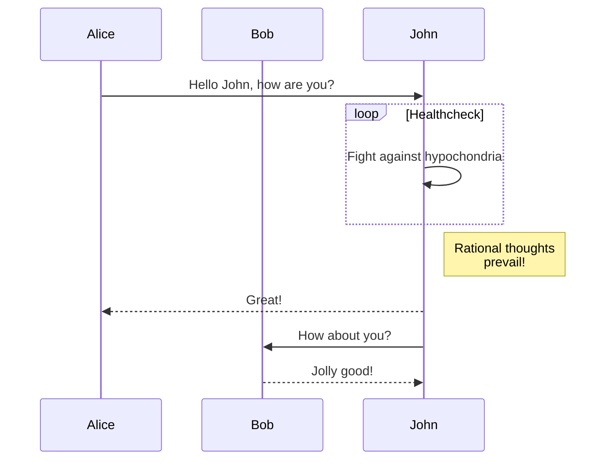

# Hello World

Testing out markdown capabilities

## Checkboxes

- [ ] So this is what it looks like?
- [X] ~~*That's neat, VSCode even gave me a counter*~~ [2020-09-16]

Oh ho ho, that's pretty neat.

## Emojis

🤡

ok we're done here.

## Math

$$\int x^2 \, dx = \frac{x^3}3 +C$$
$$\iint r(\cos\varphi+\sin\varphi)\,d\varphi\,dr$$

Well, if only math equations works natively...

This should work, but it's kind of cumbersome to do...

## Graph

Well, if only Mermaid works natively...
