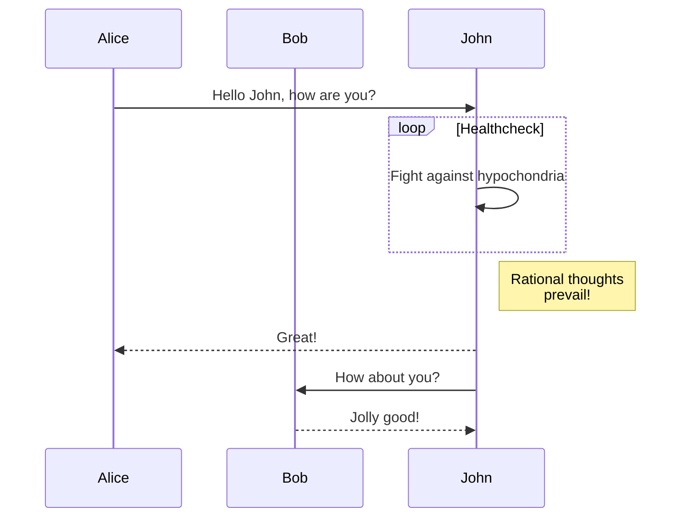

# Hello World

Testing out markdown capabilities

## Emojis

😱 😎

ok we're done here.

## Math

$$\int x^2 \, dx = \frac{x^3}3 +C$$
$$\iint r(\cos\varphi+\sin\varphi)\,d\varphi\,dr$$

Pretty neat.

## Graph

Well, if only Mermaid works natively...
